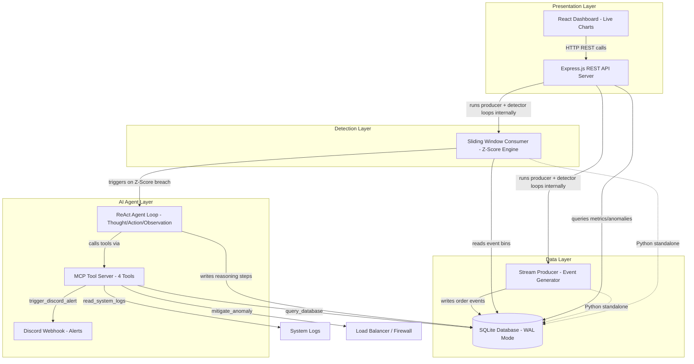

<div align="center">

# Aegis

### Real-Time Streaming Anomaly Detection with Autonomous AI Agent Mitigation

**An AI-powered full-stack system that detects traffic anomalies in real-time order streams using statistical Z-Score analysis, and autonomously mitigates threats through a ReAct reasoning agent with MCP tool integration and Discord alerting.**

---

[Architecture](#architecture-overview) • [Setup](#setup-instructions) • [Run](#run-instructions) • [Testing](#running-tests) • [AI Usage](#ai-assisted-development)

</div>

---

## Table of Contents

- [Architecture Overview](#architecture-overview)
- [Technology Stack](#technology-stack)
- [Prerequisites](#prerequisites)
- [Setup Instructions](#setup-instructions)
- [Run Instructions](#run-instructions)
- [Running Tests](#running-tests)
- [Project Structure](#project-structure)
- [Assumptions & Limitations](#assumptions--limitations)
- [AI-Assisted Development](#ai-assisted-development)

---

## Architecture Overview

Aegis is a dual-runtime (Python + Node.js/TypeScript) full-stack platform composed of five interacting layers:



### Data Flow

1. **Producer** (`stream/producer.py` or the Node.js server loop) continuously generates simulated order events with a 5% chance of injecting a traffic spike (15–30 burst orders from a single source).
2. **SQLite** (`storage/events.db`) stores all events, anomalies, and agent reasoning logs using Write-Ahead Logging (WAL) for safe concurrent access.
3. **Consumer / Detector** (`detection/consumer.py` or the Node.js server loop) polls the database every second, builds 1-second event bins across a sliding window, computes the sample mean, standard deviation, and Z-Score, and fires an anomaly when the Z-Score breaches the configured threshold.
4. **ReAct Agent** (`ai/agent_loop.py` or `src/server_agent.ts`) is spawned automatically on each anomaly. It runs a Thought → Action → Observation reasoning loop (powered by Gemini 2.5 Flash or a deterministic rule-based fallback) that calls real MCP tools to query the database, inspect system logs, block malicious traffic sources, and send Discord alerts.
5. **MCP Server** (`mcp_server.py`) exposes four tools: `query_database`, `read_system_logs`, `mitigate_anomaly`, and `trigger_discord_alert`.
6. **React Dashboard** (`src/App.tsx`) connects to the Express REST API and renders live area charts, real-time Z-Score metrics, interactive configuration controls, an anomaly log, and a step-by-step ReAct agent trace viewer.

---

## Technology Stack

| Category | Technology |
|---|---|
| Languages | Python 3.10+, TypeScript / Node.js |
| Frontend | React 19, Tailwind CSS v4, Recharts, Vite 6 |
| Backend | Express.js, tsx (TypeScript executor) |
| Database | SQLite 3 (WAL mode, thread-local connection pooling) |
| AI Model | Google Gemini 2.5 Flash (free tier REST API) |
| MCP | Custom Model Context Protocol tool server (Python) |
| Integrations | Discord Webhook API |
| Testing | Python `unittest` |
| Source Control | GitHub |
| Tooling | All free / open-source tools |

---

## Prerequisites

Before running the project, ensure you have the following installed:

- **Node.js** v18 or higher — [Download](https://nodejs.org/)
- **Python** 3.10 or higher — [Download](https://www.python.org/downloads/)
- **Git** — [Download](https://git-scm.com/)

---

## Setup Instructions

### 1. Clone the Repository

```bash
git clone <your-repository-url>
cd aegis
```

### 2. Install Node.js Dependencies

```bash
npm install
```

### 3. Install Python Dependencies

The Python backend uses only standard library modules plus `python-dotenv` and optionally `requests`:

```bash
pip install python-dotenv requests
```

> `requests` is only required if you configure a Discord webhook URL or a Gemini API key. The system gracefully degrades without them.

### 4. Configure Environment Variables

Copy the example environment file and fill in your values:

```bash
cp .env.example .env
```

Edit `.env` with the following variables:

| Variable | Required | Description | Default |
|---|---|---|---|
| `GEMINI_API_KEY` | Optional | Google Gemini API key for live AI ReAct reasoning. Get one free at [Google AI Studio](https://aistudio.google.com/apikey). If not set, the agent uses a deterministic rule-based fallback. | `""` |
| `DISCORD_WEBHOOK_URL` | Optional | Discord webhook URL for real-time alert notifications. If not set, alerts are logged to console only. | `""` |
| `EVENT_INTERVAL` | Optional | Interval in seconds between each simulated order event (Python producer). | `0.2` |
| `WINDOW_SIZE` | Optional | Sliding window size in seconds for historical statistical analysis. | `60` |
| `Z_SCORE_THRESHOLD` | Optional | Z-Score value above which an anomaly is triggered. | `3.0` |
| `SQLITE_DB` | Optional | Path to the SQLite database file. | `storage/events.db` |

Example `.env` file:

```env
GEMINI_API_KEY="your-gemini-api-key-here"
DISCORD_WEBHOOK_URL="https://discord.com/api/webhooks/your-webhook-url"
EVENT_INTERVAL=0.2
WINDOW_SIZE=60
Z_SCORE_THRESHOLD=3.0
SQLITE_DB=storage/events.db
```

---

## Run Instructions

The project supports two independent runtimes. The **Node.js full-stack server** is the primary recommended mode as it bundles the producer, detector, agent, and dashboard into a single process.

### Mode A: Full-Stack Node.js Server (Recommended)

This single command starts everything — the Express API, the React dashboard, the event producer loop, the sliding window detector, and the autonomous agent:

```bash
npm run dev
```

Open your browser to **http://localhost:3000** to view the live dashboard.

The dashboard includes:
- **Live Area Chart** showing events-per-second over the last 90 seconds
- **Real-time Metrics** — current Z-Score, sliding window mean, standard deviation, active threats
- **Interactive Controls** — adjust Z-Score threshold, window size, and event speed live
- **Manual Surge Button** — inject a traffic spike to immediately test detection
- **Anomaly Log** — view all detected anomalies with Z-Scores and timestamps
- **ReAct Agent Trace Viewer** — click any anomaly to see its full Thought → Action → Observation → Final Response reasoning chain

### Mode B: Python Backend (Standalone)

The Python components can be run independently for testing or demonstration without the Node.js server. Open **three separate terminal windows**:

**Terminal 1 — Event Producer:**

```bash
python stream/producer.py
```

This starts the continuous event generator, writing order events to `storage/events.db`.

**Terminal 2 — Anomaly Detector:**

```bash
python detection/consumer.py
```

This starts the sliding window Z-Score consumer. It polls the database every second and automatically spawns the ReAct agent subprocess when a breach is detected.

**Terminal 3 — Manual Agent Execution (Optional):**

If you want to manually run the agent against a specific anomaly ID:

```bash
python ai/agent_loop.py <anomaly_id>
```

Replace `<anomaly_id>` with an ID from the `anomalies` table in the SQLite database.

### Mode C: MCP Server (Standalone Testing)

The MCP tool server can be imported and used programmatically in any Python script:

```python
from mcp_server import MCPServer

mcp = MCPServer()
print(mcp.list_tools())
print(mcp.query_database("SELECT count(*) FROM events"))
print(mcp.read_system_logs())
```

### Building for Production

```bash
npm run build
npm start
```

This compiles the React frontend with Vite, bundles the Express server with esbuild, and serves the static build from the `dist/` directory.

---

## Running Tests

The project includes a Python `unittest` test suite covering the core happy-path scenarios:

- Statistical Z-Score calculations (standard and zero-variance edge case)
- SQLite database insertion for events and anomalies
- MCP server tool listing and query execution
- MCP mitigation actions
- Full ReAct agent loop execution with step verification

Run all tests:

```bash
python -m pytest test_cases/test_anomaly.py -v
```

Or using the standard `unittest` runner:

```bash
python -m unittest test_cases.test_anomaly -v
```

Expected output: 5 passing tests.

---

## Project Structure

```
aegis/
├── ai/
│   └── agent_loop.py          # ReAct reasoning agent (Thought → Action → Observation → Final Response)
├── alerts/
│   └── discord_alert.py       # Discord webhook rich embed alert dispatcher
├── detection/
│   └── consumer.py            # Sliding window Z-Score anomaly detector (Python standalone)
├── storage/
│   ├── db.py                  # SQLite database manager (WAL mode, thread-local connections)
│   ├── events.db              # Runtime SQLite database (auto-created)
│   └── system.log             # System activity log file
├── stream/
│   └── producer.py            # Continuous order event generator with spike injection (Python standalone)
├── test_cases/
│   └── test_anomaly.py        # Python unittest suite (5 test cases)
├── src/
│   ├── App.tsx                # React dashboard frontend (live charts, controls, agent trace viewer)
│   ├── server_agent.ts        # TypeScript ReAct agent loop (Node.js server-side)
│   ├── server_db.ts           # TypeScript SQLite database wrapper (Node.js server-side)
│   ├── main.tsx               # React app entry point
│   └── index.css              # Global styles (Tailwind CSS v4)
├── sample_data/
│   ├── anomaly_sample.json    # Sample anomalous traffic data (burst pattern)
│   └── normal_sample.json     # Sample normal traffic data (steady state)
├── dashboard/
│   └── dashboard.py           # Optional standalone Python dashboard
├── server.ts                  # Express.js full-stack server (producer + detector + API + Vite)
├── mcp_server.py              # MCP tool provider server (4 tools: query, logs, mitigate, alert)
├── config.py                  # Centralized Python configuration from .env
├── .env.example               # Environment variable template
├── ai_prompts.md              # Key AI prompts used during development
├── ai_usage_note.md           # AI usage report and team information
├── package.json               # Node.js dependencies and scripts
├── vite.config.ts             # Vite build configuration
├── tsconfig.json              # TypeScript configuration
└── index.html                 # HTML entry point for Vite
```

---

## Assumptions & Limitations

### Assumptions

1. **Simulated Data:** The event stream is synthetically generated to model an e-commerce order pipeline. Real production systems would replace the producer with actual API/webhook event ingestion.
2. **SQLite Concurrency:** The system uses SQLite WAL mode and thread-local connection pooling for concurrent reads/writes. This is suitable for prototype-scale workloads but not for high-throughput production environments where PostgreSQL or a distributed database would be required.
3. **Gemini Free Tier:** The live AI ReAct loop uses the Google Gemini 2.5 Flash free tier, which has rate limits (requests per minute) and token limits. The system includes a full deterministic fallback that executes real MCP tool calls when no API key is configured.
4. **Discord Webhook:** Alert notifications require a valid Discord webhook URL. When not configured, alerts are simulated and logged to the console.
5. **Single-Node Deployment:** The prototype is designed to run on a single machine. There is no horizontal scaling, load balancing, or distributed message queue.
6. **Statistical Model:** Anomaly detection relies exclusively on Z-Score analysis over a fixed sliding window. This is effective for detecting sudden volume spikes but may not catch gradual drifts, seasonal patterns, or multi-dimensional anomalies.

### Limitations

1. **SQLite Lock Contention:** Under very high event throughput (hundreds of events/second), SQLite may experience write contention. The 30-second connection timeout mitigates this, but a production system should use a more robust database.
2. **Agent Loop Depth:** The ReAct agent is capped at 4 reasoning iterations to prevent runaway API costs. Complex multi-step investigations may not fully resolve within this budget.
3. **No Authentication:** The dashboard and API endpoints have no authentication or authorization. This is acceptable for a prototype demo but must be secured for any real deployment.
4. **MCP Scope:** The MCP server currently exposes 4 tools. Extending it to support additional actions (e.g., querying external threat intelligence APIs, scaling infrastructure) would require additional tool definitions.
5. **No Historical Persistence:** Old events are periodically pruned (every 60 seconds) to keep the database size manageable. Long-term trend analysis is not supported without modifying the pruning interval.
6. **Python + Node.js Dual Runtime:** The project contains parallel implementations in both Python and Node.js. Running both simultaneously against the same database is supported (thanks to WAL mode) but may lead to duplicate anomaly detections.

---

## AI-Assisted Development

This project was co-created with AI coding assistants. Detailed documentation is available in:

- **[ai_usage_note.md](ai_usage_note.md)** — What AI helped with, what AI got wrong, and how issues were resolved
- **[ai_prompts.md](ai_prompts.md)** — Complete log of key prompts used during development

### AI Capabilities Demonstrated

| Capability | Implementation |
|---|---|
| **Agent Loop** | ReAct reasoning loop (`ai/agent_loop.py`, `src/server_agent.ts`) with Thought → Action → Observation → Final Response steps, powered by Gemini 2.5 Flash or deterministic fallback |
| **MCP Tool Server (Built)** | Custom MCP server (`mcp_server.py`) exposing 4 tools: `query_database`, `read_system_logs`, `mitigate_anomaly`, `trigger_discord_alert` |
| **External API Integration** | Google Gemini REST API for live AI reasoning + Discord Webhook API for real-time alerting |

---

<div align="center">

**Aegis** — Built for the AI Prototype Challenge

</div>
